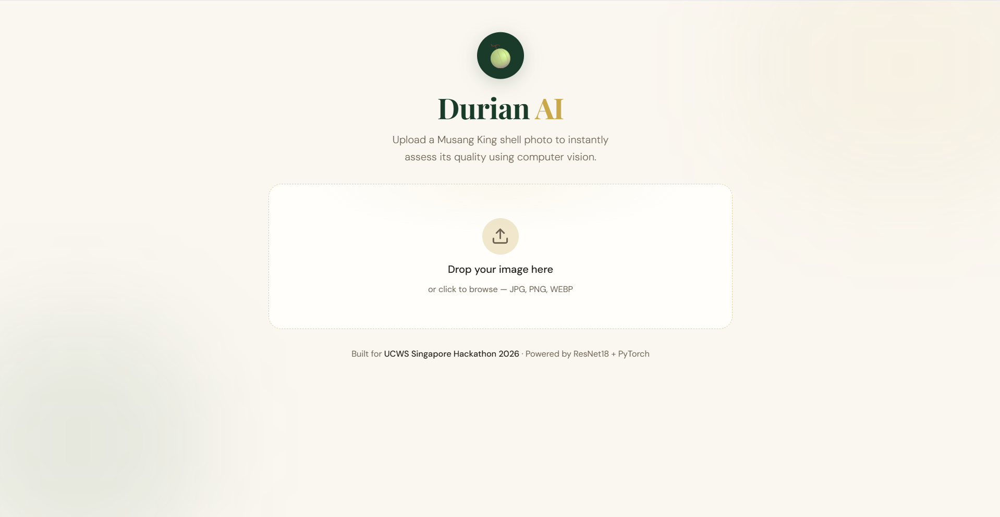

# Durian AI 🍈

> "We created a semi-automated pipeline to generate labels for Musang King quality assessment, then trained a classifier and integrated it into a web application."

AI-powered Musang King quality assessment using computer vision. Upload a shell photo and get an instant **Good / Average / Bad** quality prediction, powered by a fine-tuned ResNet18 model.

Built for the **UCWS Singapore Hackathon 2026** by Alicia Ong & Jeremy Ng.

---

## Problem Statement

Assessing Musang King quality traditionally relies on manual inspection and experience. Quality grading can be subjective and inconsistent, especially when performed at scale. Durian AI explores whether computer vision can assist in automating this process using shell images.

---

## Solution Overview

Durian AI uses a multi-stage AI pipeline:

1. Vision-Language Model feature extraction
2. Rule-based quality scoring
3. ResNet18 image classification
4. Interactive web application

The system predicts whether a Musang King durian belongs to one of three quality categories: **Good**, **Average**, or **Bad**.

---

## Dataset Generation

Labelled Musang King quality datasets are limited and difficult to obtain. To address this, we developed a semi-automated labelling pipeline:

1. A Vision-Language Model extracts visible shell characteristics
2. Rule-based scoring converts these characteristics into quality labels
3. The generated labels are used to train a ResNet18 classifier

This approach significantly reduces manual labelling effort while enabling the creation of a training dataset.

---

## System Architecture

```
Musang King Image
        ↓
React Frontend
        ↓
Python Backend
        ↓
ResNet18 Model
        ↓
Quality Prediction
        ↓
Displayed to User
```

---

## Application Preview

### Home Page


### Prediction Result


> To add screenshots, create a `screenshots/` folder in the root and add `homepage.png` and `result.png`.

---

## Project Structure

```
durian/
├── backend/
│   ├── main.py
│   ├── model.py
│   ├── utils.py
│   ├── durian_model.pth
│   └── requirements.txt
└── frontend-react/
    ├── src/
    │   ├── App.jsx
    │   ├── App.css
    │   ├── main.jsx
    │   └── index.css
    ├── index.html
    ├── vite.config.js
    └── package.json
```

---

## Prerequisites

- [Python 3.9+](https://www.python.org/downloads/) — tick **"Add Python to PATH"** during installation
- [Node.js 18+](https://nodejs.org/)

---

## Running Locally

You need **two terminals** open at the same time.

### Terminal 1 — Backend

```bash
cd durian/backend
pip install -r requirements.txt
py main.py
```

The backend will start at `http://localhost:8000`. To verify, open that URL in your browser — you should see:

```json
{"status": "Durian AI backend is running 🍈"}
```

### Terminal 2 — Frontend

```bash
cd durian/frontend-react
npm install
npm run dev
```

The frontend will start at `http://localhost:5173`.

---

## Usage

1. Open `http://localhost:5173` in your browser
2. Upload a Musang King shell photo (JPG, PNG, or WEBP)
3. Click **Analyse quality**
4. View the predicted quality grade and confidence scores

---

## Troubleshooting

**`python` not recognised on Windows**
Use `py` instead:
```bash
py main.py
```

**`npm run dev` fails with missing module error**
Delete and reinstall node_modules:
```bash
rmdir /s /q node_modules
npm install
npm run dev
```

**Prediction not working / network error**
Make sure the backend terminal is still running before clicking Analyse. Both terminals must be open at the same time.

---

## Tech Stack

| Layer | Technology |
|-------|------------|
| Frontend | React, Vite, Framer Motion |
| Backend | Python, FastAPI, Uvicorn |
| Model | PyTorch, ResNet18 (transfer learning) |
| Pipeline | Vision-Language Model → Rule-based scoring → Deep learning |

---

## Results

The project successfully demonstrates:

- Automated Musang King quality assessment
- Semi-automated label generation pipeline
- Deep learning image classification
- End-to-end web application deployment
- Real-time quality prediction

---

## Team

| | Role |
|--|------|
| **Alicia Ong** | Data processing, label generation pipeline, model training |
| **Jeremy Ng** | Frontend development, backend integration, UI design |
